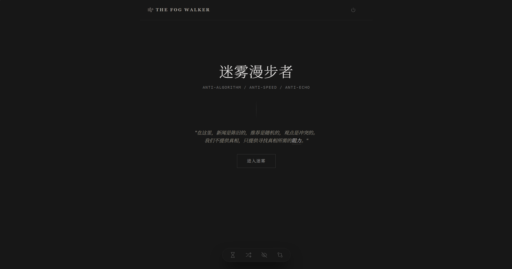
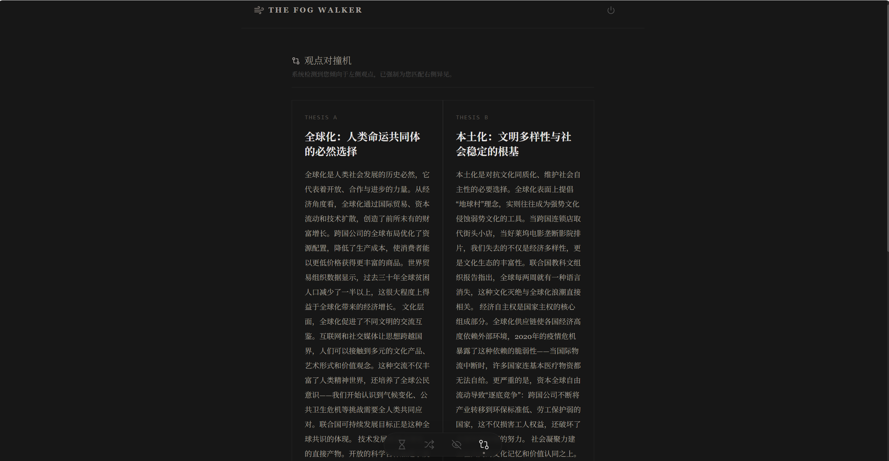

# TheFogWalker

<div align="center">



🌫️ **迷雾漫步者** - 反算法、反速度、反回声的内容过滤器

_在这里，新闻是陈旧的，推荐是随机的，观点是冲突的。<br/>
我们不提供真相，只提供寻找真相所需的阻力。_

<p align="center">
  <a href="#功能特性">功能</a> •
  <a href="#安装与配置">安装</a> •
  <a href="#技术栈">技术栈</a> •
  <a href="#项目结构">结构</a> •
  <a href="#配置说明">配置</a>
</p>
</div>

## 🌫️ 项目理念

在信息过载的时代，我们被算法投喂、被速度绑架、被回声裹挟。

TheFogWalker（迷雾漫步者）是一个反算法的内容过滤器，它不提供最快、最热、最迎合你偏好的内容，而是提供**阻力**——

- **沉淀池** 拦截短暂的噪音，只保留经得起时间冲刷的内容
- **虫洞** 带你通往不为人知的深度角落，强制慢阅读
- **去标签** 剥离作者、时间、点赞等元数据，让你直面观点本身
- **对撞机** 强制你阅读对立观点，逃离回声室

我们不是推荐引擎，我们是 **认知阻力生成器**。

## ✨ 功能特性

### 🏛️ 沉淀池 (Sediment Filter)
- AI自动筛选过去7天内的深度内容
- 过滤掉情绪宣泄和八卦娱乐
- 只保留有长期价值的技术、社会、文化、科学内容
- 24小时缓存，减少AI调用成本

### 🌀 虫洞 (Wormhole)
- 探索阅读量<100的深度内容
- 强制30秒慢读，防止快速滚动
- 每次随机生成新的冷门内容
- 跨学科、跨领域的小众洞见

### 🎭 去标签 (Labelless Reader)
- 剥离作者、时间、来源、点赞等元数据
- 只展示纯粹的观点内容
- 独立思考后再显示作者信息
- 检测认知偏见

### 💥 对撞机 (Opinion Collider)
- 生成完全对立的两种观点
- 必须阅读双方内容才能解锁
- 逃离算法回音室
- 支持多种话题：技术vs人文、个体vs集体等



## 🛠️ 技术栈

- **框架**: Next.js 13.5.6 (React 18.2.0 + TypeScript)
- **样式**: Tailwind CSS
- **AI集成**: OpenAI SDK (兼容任何OpenAI格式API)
- **部署**: 支持Vercel、Docker等

### 支持AI模型
- 理论上支持任何兼容OpenAI格式的API
- 测试模型：GPT-4、GPT-3.5-turbo、Claude等
- 支持自定义BaseURL和API Key

## 🔧 安装与配置

### 前置要求
- Node.js ≥ 18.16.1
- Git
- 兼容OpenAI格式的API Key

### 安装步骤

1. **克隆仓库**
```bash
git clone https://github.com/2679373161/TheFogWalker.git
cd TheFogWalker
```

2. **安装依赖**
```bash
npm install
```

3. **配置环境变量**

复制 `.env.example` 到 `.env.local`:
```bash
cp .env.example .env.local
```

编辑 `.env.local`:
```env
# AI API 配置（兼容OpenAI格式）
AI_API_BASE_URL=https://api.openai.com/v1
AI_API_KEY=your_api_key_here
AI_MODEL=gpt-4-turbo-preview

# 应用配置
APP_TIMEOUT=30000
RATE_LIMIT_PER_MINUTE=10
```

**支持的其他AI服务：**
- **Claude API**: `AI_API_BASE_URL=https://api.anthropic.com/v1`
- **本地模型**: `AI_API_BASE_URL=http://localhost:1234/v1` (如Ollama、LMStudio)

4. **启动开发服务器**
```bash
npm run dev
```

访问 http://localhost:3000

## 📁 项目结构

```
TheFogWalker/
├── app/                              # Next.js App Router
│   ├── api/                          # AI API路由
│   │   ├── sediment/route.ts         # 沉淀池API
│   │   ├── wormhole/route.ts         # 虫洞API
│   │   ├── labelless/route.ts        # 去标签API
│   │   └── collider/route.ts         # 对撞机API
│   ├── globals.css                   # 全局样式
│   ├── layout.tsx                    # 根布局
│   └── page.tsx                      # 主页面
├── components/                       # React组件
│   ├── NavBtn.tsx                    # 导航按钮
│   ├── common/
│   │   └── LoadingSpinner.tsx        # 加载动画
│   └── modules/                      # 功能模块
│       ├── IntroScreen.tsx           # 介绍页
│       ├── SedimentFilter.tsx        # 沉淀池
│       ├── Wormhole.tsx              # 虫洞
│       ├── LabellessReader.tsx       # 去标签
│       ├── OpinionCollider.tsx       # 对撞机
│       └── DigitalSabbath.tsx        # 数字安息日
├── lib/                             # 库函数
│   ├── ai/
│   │   ├── client.ts                # OpenAI客户端
│   │   └── prompts.ts               # AI Prompt模板
│   ├── cache/
│   │   └── content.ts               # 内容缓存
│   └── utils/
│       └── date.ts                  # 日期工具
├── types/                           # TypeScript类型
│   └── content.ts                   # 内容类型定义
├── public/                          # 静态资源
├── .env.example                     # 环境变量示例
├── .gitignore                       # Git忽略文件
├── next.config.js                   # Next.js配置
├── package.json                     # 依赖配置
├── tailwind.config.ts               # Tailwind配置
├── tsconfig.json                    # TypeScript配置
└── postcss.config.js                # PostCSS配置
```

## ⚙️ 配置说明

### AI Prompt 自定义

每个模块都有独立的AI Prompt，可在 `lib/ai/prompts.ts` 中修改：

```typescript
// 沉淀池Prompt - 筛选长期价值内容
export const sedimentPrompt = `
你是一个信息筛选助手。请从今天的互联网热点中，筛选出那些具有长期价值的内容。
筛选标准：...
`;

// 虫洞Prompt - 发现冷门深度内容
export const wormholePrompt = `
你是一个冷门内容发现助手。请从不知名的博客、论坛、学术角落中，找到阅读数小于100的深度内容。
`;

// 去标签Prompt - 生成纯粹观点
export const labellessPrompt = `
你是一个观点提取助手。我需要一段纯粹的观点论述，不涉及任何作者信息、来源、时间等元数据。
`;

// 对撞机Prompt - 生成对立观点
export const colliderPrompt = `
你是一个观点对撞生成器。请为一个给定话题生成两个完全对立的立场。
话题：技术加速主义 vs 技术刹车论
`;
```

### 缓存策略

缓存配置在 `lib/cache/content.ts`：

```typescript
export const CACHE_EXPIRY = {
  SEDIMENT: 24 * 60 * 60 * 1000,  // 沉淀池: 24小时
  WORMHOLE: 30 * 60 * 1000,       // 虫洞: 30分钟（实际不缓存，每次新内容）
  LABELLESS: 60 * 60 * 1000,     // 去标签: 1小时
  COLLIDER: 2 * 60 * 60 * 1000,  // 对撞机: 2小时
};
```

### 环境变量

| 变量 | 说明 | 默认值 |
|------|------|--------|
| `AI_API_BASE_URL` | AI API地址 | `https://api.openai.com/v1` |
| `AI_API_KEY` | API密钥 | 必填 |
| `AI_MODEL` | AI模型 | `gpt-4-turbo-preview` |
| `APP_TIMEOUT` | API超时(ms) | `30000` |

## 🎨 UI/UX 设计

### 设计哲学
- 极简主义：黑白灰配色，减少视觉干扰
- 认知摩擦：强制等待、慢读、对立观点
- 信息节食：精选而非海量

### 交互设计
- 底部机械开关样式的导航
- 严格执行的「强制停留」机制
- 去标签实验的双阶段揭示
- 对撞机的双边锁定解锁机制

## 🚀 部署

### Vercel（推荐）

一键部署：

[](https://vercel.com/new/clone?repository-url=https://github.com/2679373161/TheFogWalker.git)

需配置环境变量：
- `AI_API_BASE_URL`
- `AI_API_KEY`
- `AI_MODEL`

### Docker

```dockerfile
FROM node:18-alpine
WORKDIR /app
COPY package*.json ./
RUN npm ci --only=production
COPY . .
RUN npm run build
EXPOSE 3000
CMD ["npm", "start"]
```

构建和运行：
```bash
docker build -t the-fog-walker .
docker run -p 3000:3000 \
  -e AI_API_BASE_URL=https://api.openai.com/v1 \
  -e AI_API_KEY=your_key \
  the-fog-walker
```

## 🤝 贡献

欢迎提交 Issue 和 Pull Request！

### 开发指南

1. Fork 本仓库
2. 创建特性分支 (`git checkout -b feature/AmazingFeature`)
3. 提交更改 (`git commit -m 'Add some AmazingFeature'`)
4. 推送到分支 (`git push origin feature/AmazingFeature`)
5. 开启 Pull Request

### 待办事项

- [ ] 添加用户偏好设置
- [ ] 实现内容收藏功能
- [ ] 添加更多对撞机话题
- [ ] 支持多语言内容
- [ ] 添加内容导出功能
- [ ] 实现RSS订阅
- [ ] 添加暗黑/亮色主题切换
- [ ] 实现离线缓存

## 📄 许可证

本项目采用 MIT 许可证。详见 [LICENSE](LICENSE) 文件。

## 🙏 致谢

- 设计理念受 [Neil Postman](https://en.wikipedia.org/wiki/Neil_Postman) 的媒介批评理论启发
- UI设计参考了 brutalist web design 和 古典印刷美学
- 感谢所有为对抗算法暴政而努力的项目和思想家

---

<div align="center">

**[⬆ Back to Top](#thefogwalker)**

</div>
